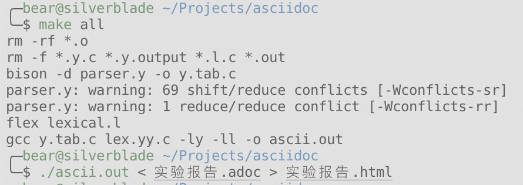

= 基于Asciidoc的轻量级标记语言 =

IMPORTANT: 此项目在Unix环境下编译运行, 没有适配Windows环境. +
作者: 熊子稼 郭浩然 刘越 汤丹丹 

Asciidoc是一种功能强大且简便易用的轻量级标记语言<<HOMEPAGE>>. 它与目前常见的Markdown标记语言类似, 甚至部分兼容. 但比Markdown更为强大.

本此实验我们尝试使用YACC(BISON)和LEX(FLEX)两种工具, 实现一种基于Asciidoc的轻量级标记语言.

NOTE: 目前本项目还不是非常完善, 如感兴趣, 可以关注作者的 +
Github: https://github.com/RRRRRm 和 +
个人主页 https://superbear.me +
(其实这段话就是凑个字数展示一下NOTE功能)

由于时间仓促, 我们只实现了老师要求做到的全部功能, 更多复杂功能没有实现. 但框架已经建立, 完善只是时间问题.

本次实验没有使用开源代码, 但受到了以下项目启发<<HELPER>>, 在此特别感谢.

= 词法分析 =
使用flex做词法分析, flex是一种生成扫描器的工具. 通过编写正则表达式, 程序可以自动生成自动机. 以供词法分析使用.

= 语法分析 =
由于时间限制, 没能将语法中的移进-规约冲突完全消除. 目前的产生式如下所示:

file: content +
    ; +

content: +
       | content block_list +
       | content tight_bolck +
       ; +

block_list: +
          | block +
          | block_list EMPTY_LINE +
          | block_list EMPTY_LINE block +
          ; +

block: paragraph +
     | NOTE paragraph +
     | TIP paragraph +
     | WARN paragraph +
     | IMPT paragraph +
     | CAUTN paragraph +
     | QTSOURCE EOL qtsource_list +
     ; +

qtsource_list: qtsource_item +
             | qtsource_list qtsource_item +
             ; +

qtsource_item: UL L_THREE_SB inline_item_list R_THREE_SB inline_item_list EOL +
             ; +

tight_bolck: header +
           | image +
           ; +

image: IMG IMG_PATH img_attrs EOL +
     ; +

img_attrs: +
         | img_attrs IMG_CAPTION IMG_ATTR_VALUE +
         | img_attrs IMG_TITLE IMG_ATTR_VALUE +
         | img_attrs IMG_WIDTH IMG_ATTR_VALUE +
         | img_attrs IMG_HIGHT IMG_ATTR_VALUE +

header: LH1 inline_item_list RH1 EOL +
      | LH2 inline_item_list RH2 EOL +
      | LH3 inline_item_list RH3 EOL +
      | LH4 inline_item_list RH4 EOL +
      | LH5 inline_item_list RH5 EOL +
      | LH6 inline_item_list RH6 EOL +
      ; +

paragraph: paragraph inline_item_list EOL +
         | inline_item_list EOL +
         ; +

inline_item_list: inline_item_list inline_item  +
                | inline_item  +
                ; +
inline_item: text +
           | LBOLD inline_item_list RBOLD +
           | LITALIC inline_item_list RITALIC +
           | LQT inline_item_list RQT +
           | CR +
           | SPACE +
           ; +

text: CHAR  
    | text CHAR  
    ;

= 实现功能 =

实现的功能基本都在报告中展示了
字体支持 *黑体*, _斜体_, _*斜黑体*_ , *_混合_体*

=== 多级标题 ===

WARNING: 提示 +
标签

插图(见下方)

参考文献(见页末)

= 编译运行 =
使用命令行编译, 即可生成HTML文档

= 任务分工 =

熊子稼(201683080091)：代码实现 +
郭浩然(201683080082)：语法分析 +
刘越(201683080007)：软件测试 +
汤丹丹(201683080062)：编写文档 +

= 附注 =

[bibliography]
- [[[HOMEPAGE]]] Asciidoc项目官网在 http://asciidoc.org/ 上面有详细的介绍
- [[[HELPER]]] 开源项目LuoZhongYao/helper: 使用 yacc & flex ( flex & bison )实现markdown的解析 https://github.com/LuoZhongYao/helper
- [[[HELPER]]] 开源项目toshiya/my-markdown-parser: A sample app for lex and yacc practice.
